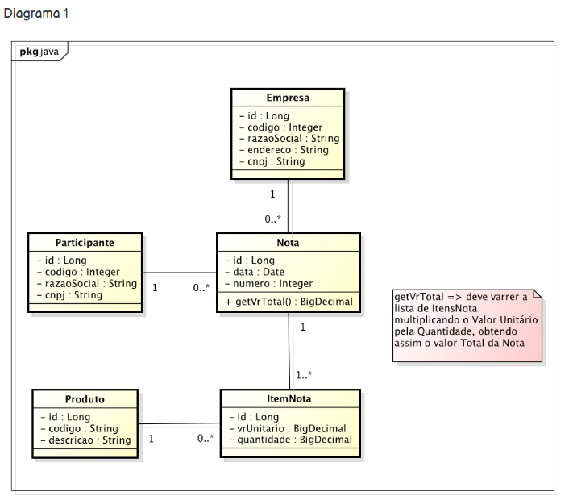
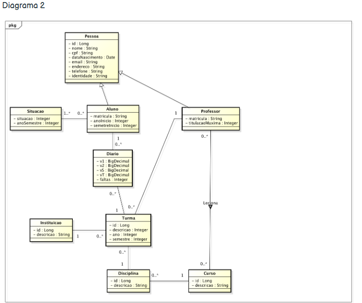

# 🧾 Modelagem de Sistemas — Diagramas UML (Java)

Este repositório contém **modelos de classes UML** desenvolvidos para projetos acadêmicos da faculdade, com foco em **engenharia de software orientada a objetos**.  
Os diagramas representam a estrutura e os relacionamentos entre entidades em dois contextos distintos: **sistema de notas fiscais** e **sistema acadêmico**.

---

## 🧩 Diagrama 1 — Sistema de Notas Fiscais

O primeiro diagrama representa a estrutura de um **sistema de emissão de notas fiscais**, incluindo empresas, participantes, produtos e itens de nota.  
Ele exemplifica os conceitos de **composição**, **agregação** e **associações** em Java.

### 📘 Entidades Principais
- **Empresa** — emite as notas fiscais.  
- **Participante** — representa o cliente ou fornecedor.  
- **Produto** — item comercializado.  
- **ItemNota** — vincula produto e nota, incluindo valor unitário e quantidade.  
- **Nota** — contém os itens e calcula o valor total (`getVrTotal()`).

📎 **Relações**
- Uma **empresa** pode emitir várias notas.  
- Cada **nota** possui vários **itens**.  
- Cada **item** está vinculado a um **produto**.  
- Cada **nota** está associada a um **participante**.

🧮 **Lógica Importante**
> `getVrTotal()` → percorre a lista de itens da nota, multiplicando o valor unitário pela quantidade, somando o total da nota.

### 📷 Diagrama UML

---

## 🎓 Diagrama 2 — Sistema Acadêmico

O segundo diagrama modela um **sistema de gestão acadêmica**, com entidades como **aluno**, **professor**, **disciplina** e **curso**.

### 📘 Entidades Principais
- **Pessoa** — classe base para Aluno e Professor.  
- **Aluno** — possui matrícula, histórico e situação acadêmica.  
- **Professor** — ministra disciplinas e possui titulação máxima.  
- **Diário** — armazena notas e faltas.  
- **Turma** — vincula disciplinas, professores e alunos.  
- **Curso** e **Disciplina** — estruturam o plano acadêmico.  
- **Instituição** — representa a entidade de ensino.

📎 **Relações**
- Um **professor** leciona várias **disciplinas**.  
- Um **aluno** pode estar matriculado em várias **turmas**.  
- Cada **turma** pertence a uma **disciplina** e a um **curso**.

### 📷 Diagrama UML

---

## 🛠️ Tecnologias e Ferramentas
- **Astah UML** → ferramenta utilizada para modelagem dos diagramas.  
- **Java** → linguagem de programação base das entidades representadas.  
- **BigDecimal** → tipo usado para cálculos monetários precisos.

---

## 📚 Objetivo do Projeto
Esses diagramas servem como **base conceitual para implementação em Java**, auxiliando no entendimento de:
- Modelagem orientada a objetos  
- Relações entre classes  
- Encapsulamento e herança  
- Multiplicidade e cardinalidade  
- Cálculo de valores derivados (ex: total da nota)

---

## 🧠 Autor
**Guilherme Guerra**  
📘 Engenharia de Software — UniAcademia  
💻 GitHub: [@guilhermeguerradev](https://github.com/guilhermeguerradev)
